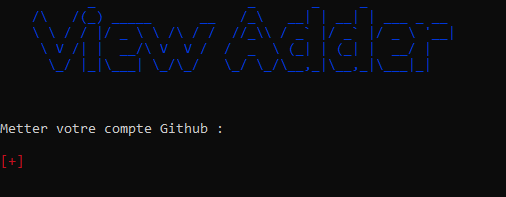
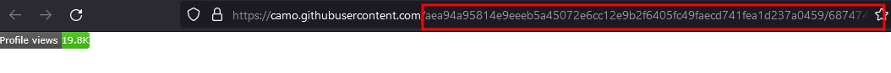

[](https://github.com/RxphGui/View-Adder)
# View Adder 👨‍💻 

*I created View-Adder to increase Github account view. When i do my profil and i add the view counter.
When i have refresh the page, i see counter +1. It's normal, but i thought to myself, i do create script for add view*

# Installation 💻

```
git clone https://github.com/Rxphgui/View-Adder
cd View-Adder/
ruby View Adder.rb
```
# To use ♟ 


it's simple, see image 1 2 3 4
[](https://github.com/RxphGui/View-Adder)
